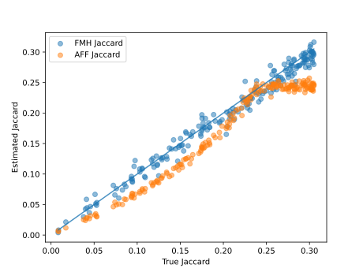
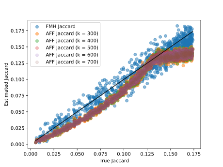

# afsampling
This repository implements FracMinHash sketching and Affirmative Sampling. See `basicTest.cpp` for use case.

After making, the following programs are generated.

## basicTest
Purpose: basic testing of implementation

## sketchSizeTest
This program will do the following:
1. Generate a random set A with x elements
1. Generate the sketch of A using FMH and AS
1. Record the sketch sizes
1. Vary x from 1K to 10M

Results:

```
10000,10.2,2.6,573,8.82043
100000,96.5,7.32462,790.3,31.8624
1000000,1004.2,26.5548,1021,30.4335
10000000,9968.3,73.369,1247,42.1829
100000000,97035.5,302.213,1486.3,24.0626
```


## accuracyTest
By using the un-filtered sketches computed using AS, we get the following accuracy.


From the looks of it, it is clear that there may be some kind of bias. Let us also investigate for other $k$-values when generating the AS sketches.



Now, I am pretty certain that there is some bias. The theory suggests that the bias can be corrected by filtering the sketches.

## Filtering the sketches and obtaining unbiased estimates
Let the sketches be $S_1$ nad $S_2$. Let the smallest hash value in $S_1 \cap S_2$ is $\tau$. We need to generate ${S_1}'$ and ${S_2}'$ as follows:

$$
{S_1}' = \{ h ~~ | ~~ h \in S_1, h \ge \tau \}
$$

and

$$
{S_2}' = \{ h ~~ | ~~ h \in S_2, h \ge \tau \}.
$$

After that, if we estimate Jaccard/containment, we should get unbiased estimates. Let us implement these filterings and re-generate the images.